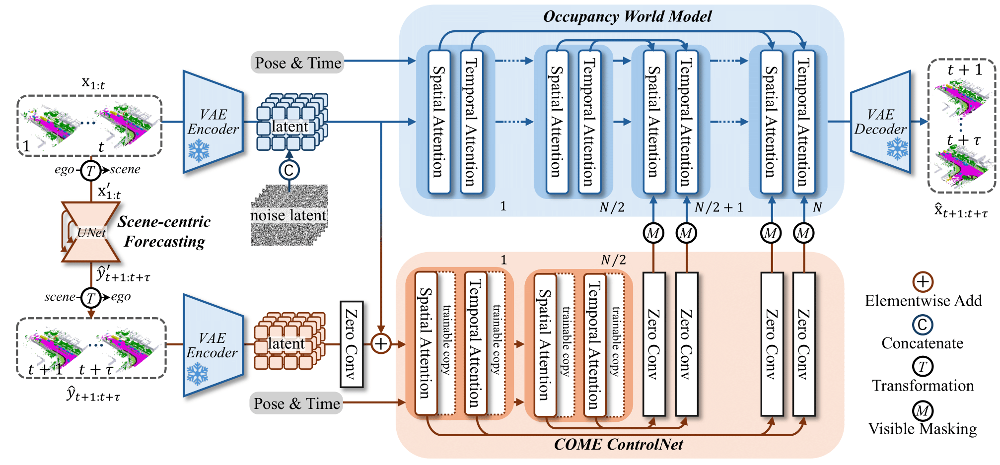
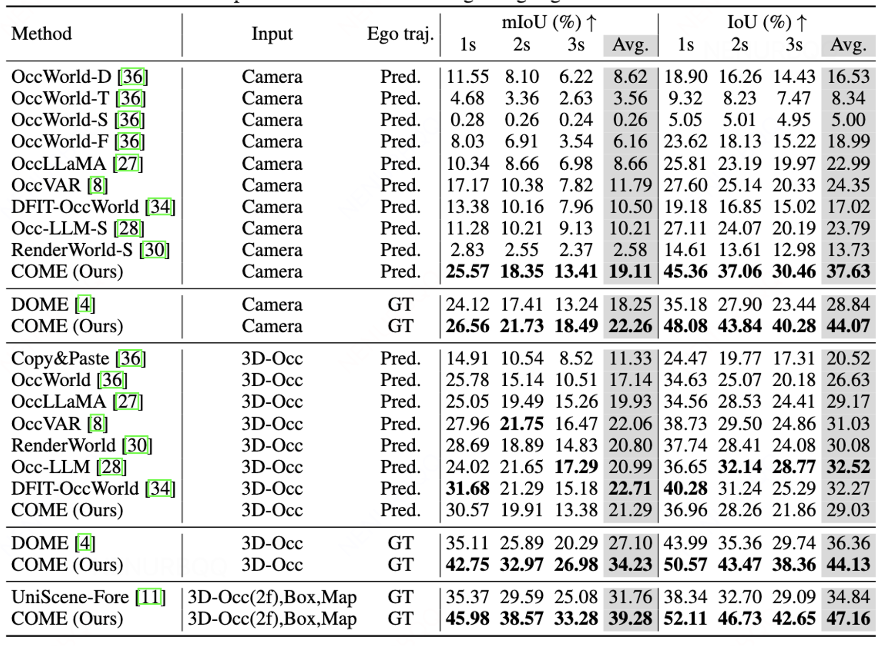

# COME: Adding Scene-Centric Forecasting Control to Occupancy World Model

# Demo Videos

The comparison of ground-truth, DOME generation with official checkpoint and COME. The task setting is to use 4-frame 3D-Occ sequences as input and predict the next 6-frame (3-s prediction) sequences. 
 
https://github.com/user-attachments/assets/f95890fb-ab5a-4f26-b9ec-3b5e44f45a99


The comparison of ground-truth, DOME generation with reproduced checkpoint and COME. The task setting is to use 4-frame 3D-Occ sequences as input and predict the next 16-frame (8-s prediction) sequences. 
 
https://github.com/user-attachments/assets/4d1ec897-578c-469a-a1dd-a9b74f7eb3cf

The COME generation with BEV layouts. The task setting is to use 2-frame 3D-Occ sequences and 8-frame BEV layouts as input and predict the next 6-frame (3-s) sequences. 
 
https://github.com/user-attachments/assets/e511e5df-71ad-42df-beab-c2725d0aad92

# Overview
COME = Forecasting Guided Generation



# Results




## 🚀 Setup
### environment setup
```
conda env create --file environment.yml
pip install einops tabulate 
cd occforecasting 
python setup.py develop
cd ..
```

### data preparation
1. Create soft link from `data/nuscenes` to your_nuscenes_path

2. Prepare the gts semantic occupancy introduced in [Occ3d](https://github.com/Tsinghua-MARS-Lab/Occ3D)

3. Download generated train/val pickle files from OccWorld or DOME.

4. Prepare the train/val pickle files for scene-centric forecasting.

```
python -m occforecasting.datasets.nusc_occ3d_dataset
```

  The dataset should be organized as follows:


```
.
└── data/
    ├── nuscenes            # downloaded from www.nuscenes.org/
    │   ├── lidarseg
    │   ├── maps
    │   ├── samples
    │   ├── sweeps
    │   ├── v1.0-trainval
    │   └── gts             # download from Occ3d
    ├── nuscenes_infos_train_temporal_v3_scene.pkl
    └── nuscenes_infos_val_temporal_v3_scene.pkl
    ├── nuscenes_train_occ3d_infos.pkl
    └── nuscenes_val_occ3d_infos.pkl
```

The four pickle files can also be downloaded in [infos](https://cloud.tsinghua.edu.cn/d/fc50462e4c1e419e80fc/).

### optinal inputs
For testing under different conditions, more inputs are needed. 
1. motion planning results with yaw angles from [BEVPlanner](https://cloud.tsinghua.edu.cn/f/79231f928c4e42a298b5/?dl=1). Please put the json file on the project root directory. We simply add a yaw regression branch on [BEV-Planner Project](https://github.com/NVlabs/BEV-Planner), Thanks for their great work.

2. [BEV layouts](https://cloud.tsinghua.edu.cn/d/dd5de659d2b840408e02/) for training and validation sets at 2Hz labels. Please unzip files and put them in './data/step2'.  The pre-processing script is from [UniScene](https://github.com/Arlo0o/UniScene-Unified-Occupancy-centric-Driving-Scene-Generation), Thanks for their great work.

3. 3D occupancy prediction results from [BEVDet](https://cloud.tsinghua.edu.cn/f/d2b1e56038e849bf9fc3/?dl=1) and [EFFOcc](https://cloud.tsinghua.edu.cn/f/3ad67a32932749239363/?dl=1). Please unzip files and put them in './data/occpreds'. Thanks for their open-source checkpoints.

4. AE evaluation protocol from [UniScene](https://github.com/Arlo0o/UniScene-Unified-Occupancy-centric-Driving-Scene-Generation), please download [AE_checkpoint](https://cloud.tsinghua.edu.cn/f/9cc40a4c42ec4c0db104/?dl=1) for request and put in './ckpts/'.
### Model Zoos
We recommend to download checkpoints with folders under './work_dir'.

| Task Setting | Inputs | Method | Config | Checkpoint |
| --- | --- | --- |  --- |  --- |
| Input-4frame-Output-6frame | 3DOcc + GT Traj | Stage1-COME-World Model | [Config](configs/train_dome_v2.py) | [CKPT](https://cloud.tsinghua.edu.cn/d/64783e9471084f50a089/)
| Input-4frame-Output-6frame | 3DOcc + GT Traj| Stage2-COME-Scene-Centric-Forecasting | [Config](occforecasting/configs/unet/unet_aligned_past2s_future_3s.py) | [CKPT](https://cloud.tsinghua.edu.cn/f/52b77abfe9ae4e379ab5/?dl=1)
| Input-4frame-Output-6frame | 3DOcc + GT Traj| Stage3-COME-ControlNet | [Config](configs/train_dome_controlnet_mask_invisible_v2.py) | [CKPT](https://cloud.tsinghua.edu.cn/d/49575f0db63b48ecab86/)
| Input-4frame-Output-6frame | 3DOcc + Pred Traj| Stage3-COME-ControlNet | [Config](configs/inference_configs/inference_dome_controlnet_mask_invisible_v2_3docc_input_pred_traj.py) | Same As Above
| Input-4frame-Output-6frame | BEVDet + Pred Traj| Stage3-COME-ControlNet | [Config](Cconfigs/inference_configs/inference_dome_controlnet_mask_invisible_v2_effocc_input_pred_traj.py) | Same As Above
| Input-4frame-Output-6frame | BEVDet + GT Traj| Stage3-COME-ControlNet | [Config](configs/inference_configs/inference_dome_controlnet_mask_invisible_v2_bevdet_input_gt_traj.py) | Same As Above
| Input-4frame-Output-6frame | EFFOcc + Pred Traj| Stage3-COME-ControlNet | [Config](configs/inference_configs/inference_dome_controlnet_mask_invisible_v2_effocc_input_pred_traj.py) | Same As Above
| Input-4frame-Output-6frame | EFFOcc + GT Traj| Stage3-COME-ControlNet | [Config](configs/inference_configs/inference_dome_controlnet_mask_invisible_v2_effocc_input_gt_traj.py) | Same As Above
| Input-4frame-Output-16frame | 3DOcc + GT Traj | Stage1-COME-World Model | [Config](configs/train_dome_v2_8s.py) | [CKPT](https://cloud.tsinghua.edu.cn/d/ad8b6632ff4c473194c6/)
| Input-4frame-Output-16frame | 3DOcc + GT Traj| Stage2-COME-Scene-Centric-Forecasting | [Config](occforecasting/configs/unet/unet_aligned_past2s_future_8s.py) |  [CKPT](https://cloud.tsinghua.edu.cn/f/b0d7de5979aa4631b792/?dl=1)
| Input-4frame-Output-16frame | 3DOcc + GT Traj| Stage3-COME-ControlNet | [Config](configs/train_dome_controlnet_8s.py) | [CKPT](https://cloud.tsinghua.edu.cn/d/4c811c10b2cc421aba10/)
| Input-2frame-Output-6frame | 3DOcc + GT Traj + BEV Layouts | Stage1-COME-World Model | [Config](configs/train_dome_v3_with_bev_layout.py) | [CKPT](https://cloud.tsinghua.edu.cn/d/351d0731a68c4de2a801/)
| Input-2frame-Output-6frame | 3DOcc + GT Traj + BEV Layouts | Stage2-COME-Scene-Centric-Forecasting | [Config](occforecasting/configs/unet/unet_aligned_past0.5s_future_3s.py) | [CKPT](https://cloud.tsinghua.edu.cn/f/0b0197065bf5453eb5ad/?dl=1)
| Input-2frame-Output-6frame | 3DOcc + GT Traj + BEV Layouts | Stage3-COME-ControlNet | [Config](configs/train_dome_controlnet_bev_layout_masked.py) | [CKPT](https://cloud.tsinghua.edu.cn/d/86811cb0d41e4db4a3ea/)
| Input-4frame-Output-6frame | 3DOcc + GT Traj | Stage1-COME-Small-World Model | [Config](configs/train_dome_v5_small.py) | [CKPT](https://cloud.tsinghua.edu.cn/d/453bc26a6dc748cab3b0/)
| Input-4frame-Output-6frame | 3DOcc + GT Traj| Stage2-COME-Scene-Centric-Forecasting | [Config](occforecasting/configs/unet/unet_aligned_past2s_future_3s.py) | Same As Above
| Input-4frame-Output-6frame | 3DOcc + GT Traj| Stage3-COME-Small-ControlNet | [Config](configs/train_dome_controlnet_small_masked.py) | [CKPT](https://cloud.tsinghua.edu.cn/d/135dbdaa63de49eb92db/)

## 🏃 Run the code
### OCC-VAE
By default, we use the [VAE checkpoint](https://cloud.tsinghua.edu.cn/f/3f326bfc190f49d08945/?dl=1) provided by [DOME](https://github.com/gusongen/DOME), thanks for their greak work.


```shell
# train 
python tools/train_vae.py --py-config ./configs/train_occvae.py --work-dir ./work_dir/occ_vae 

# eval
python tools/train_vae.py --py-config ./configs/train_occvae.py --work-dir ./work_dir/occ_vae --resume-from ckpts/occvae_latest.pth

# visualize
python tools/visualize_demo_vae.py \
    --py-config ./configs/train_occvae.py \
    --work-dir ./work_dir/occ_vae \
    --resume-from ckpts/occvae_latest.pth \
    --export_pcd \
    --skip_gt
```

### Scene-Centric Forecasting
```shell
cd occforecasting
# train 
bash train.sh occforecasting/configs/unet/unet_aligned_past2s_future_3s.py

# eval
bash test.sh occforecasting/configs/unet/unet_aligned_past2s_future_3s.py

```

### COME World Model
```shell
# train 
python tools/train_diffusion.sh --py-config ./configs/train_dome_v2.py --work-dir ./work_dir/dome_v2

# eval
python tools/eval_metric.py --py-config ./configs/train_dome_v2.py --work-dir ./work_dir/dome_v2 --resume-from ./work_dir/dome_v2/best_miou.pth --vae-resume-from ckpts/occvae_latest.pth 


# visualize
python tools/visualize_demo.py --py-config ./configs/train_dome_v2.py --work-dir ./work_dir/dome_v2 --resume-from ./work_dir/dome_v2/best_miou.pth --vae-resume-from ckpts/occvae_latest.pth 
```

### COME ControlNet
```shell
# train 
python tools/train_diffusion_control_ddp.py --py-config configs/train_dome_controlnet_mask_invisible_v2.py --work-dir work_dir/train_dome_controlnet_mask_invisible_v2 

# eval
python tools/test_diffusion_control.py --py-config configs/train_dome_controlnet_mask_invisible_v2.py --work-dir work_dir/train_dome_controlnet_mask_invisible_v2 


# visualize
python tools/visualize_demo_control_mask_invisible.py --py-config configs/train_dome_controlnet_mask_invisible_v2.py  --work-dir work_dir/train_dome_controlnet_mask_invisible_v2  --vae-resume-from ckpts/occvae_latest.pth  --skip_gt 
```


# Acknoweldgements
This project is built on top of [DOME](https://github.com/gusongen/DOME) and [OccWorld](https://github.com/wzzheng/OccWorld). Thanks for the excellent open-source works!

[DOME](https://github.com/gusongen/DOME)

[OccWorld](https://github.com/wzzheng/OccWorld)

[ControlNet](https://github.com/lllyasviel/ControlNet)

[HuyuanDiT](https://github.com/Tencent-Hunyuan/HunyuanDiT)
